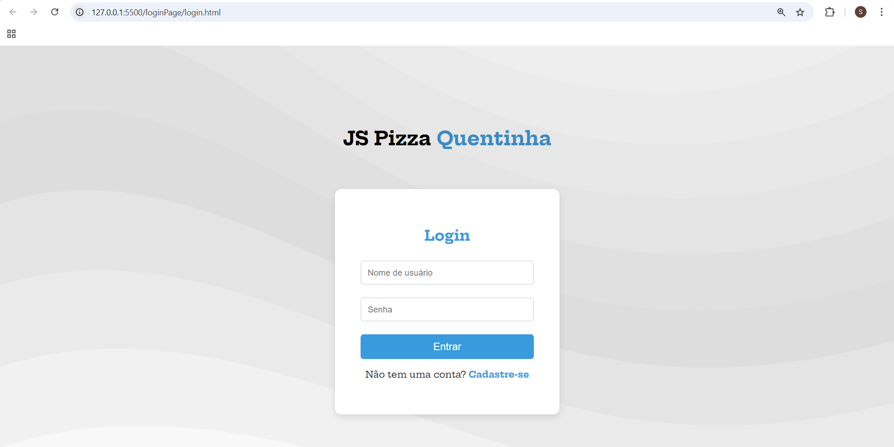
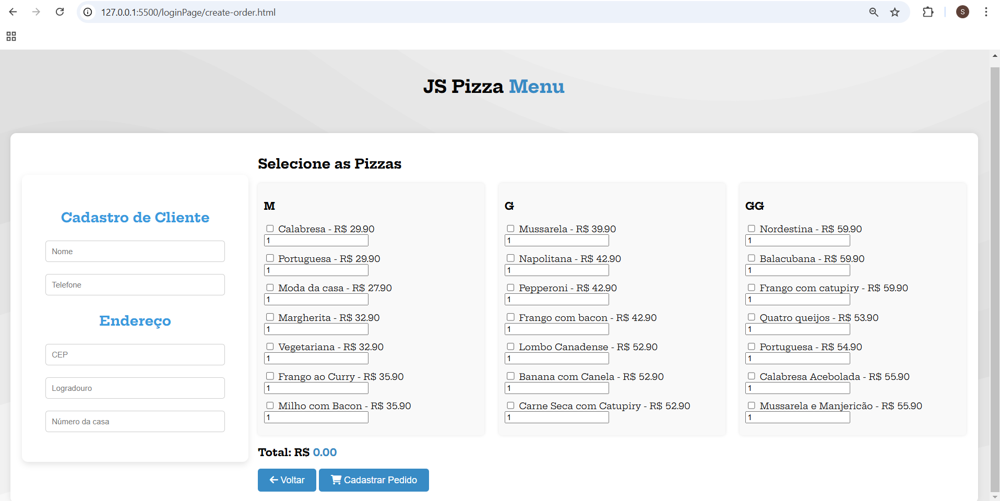
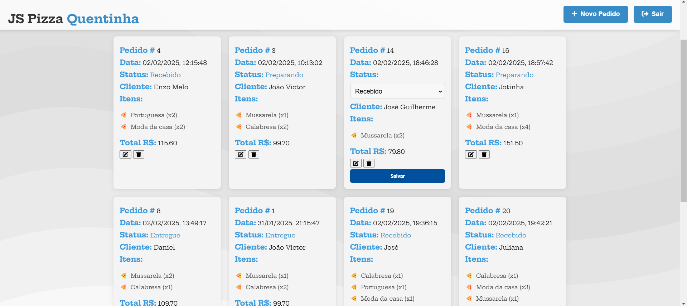
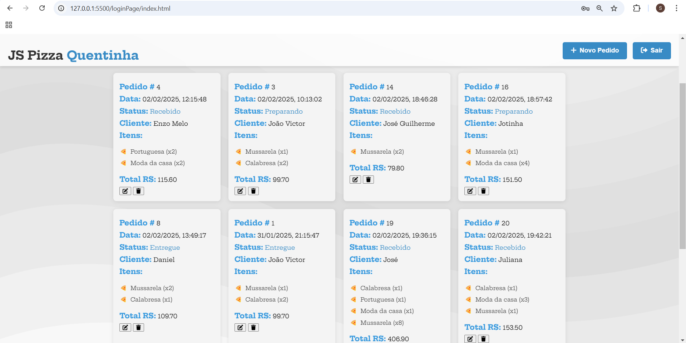

## 🍕 PizzariaAPS

### Alunos envolvidos
- João Victor de Sousa dos Santos (2024111TADS0037)
- Sâmmya Letícia Valadão da Silva (2024111TADS0032)

## Sobre o projeto
PizzariaAPS é um sistema completo de gerenciamento de pizzaria, desenvolvido como projeto final para a disciplina de Análise e Projeto de Sistemas do Instituto Federal do Piauí. O sistema foi criado para automatizar e gerenciar pedidos, clientes e funcionários de uma pizzaria. É uma aplicação full stack com backend em Java e Spring, e frontend em HTML, CSS e JavaScript.

## Tecnologias Utilizadas
### Backend:
- `Java`: Linguagem de programação utilizada para a lógica de negócios.
- `Spring Framework`: Framework utilizado para construir a API REST.
- `PostgreSQL`: Banco de dados utilizado para armazenar os dados da aplicação.

### Frontend:
- `HTML`: Linguagem de marcação utilizada para estruturar as páginas web.
- `CSS`: Linguagem de estilo utilizada para a apresentação das páginas web.
- `JavaScript`: Linguagem de programação utilizada para a interação e dinamismo das páginas web.

## Funcionalidades
- **Cadastro de Funcionários**: Permite o registro de funcionários que utilizarão o sistema.
- **Login**: Autenticação de usuários para acesso ao sistema.
- **Cadastro de Pedidos**: Permite registrar pedidos com informações do cliente e itens de pedido.
- **Exibição de Pedidos Registrados**: Lista todos os pedidos registrados no sistema.
- **Edição de Status do Pedido**: Permite alterar o status dos pedidos conforme necessário.
- **Deleção de Pedidos**: Permite excluir pedidos do sistema.

## Documentações do Projeto
1. Casos de uso envolvidos com suas respectivas documentações: [Documentação de casos de uso](https://docs.google.com/document/d/1WGz_WFqgrYYRpb5ZSMaD6YakHw7b4TUeJY0RGy-Trj0/edit?usp=sharing)
2. Diagramas de sequência correspondentes a esses casos de uso: [Diagramas de sequência de sistema](https://docs.google.com/document/d/1Ge4Vh8qNhxjYtFUGCSNcwxXEDdcgWPsEtPeTWwrRHNw/edit?usp=sharing)
3. Implementação das classes via código (plantUML): [Classes implementadas com PlantUML](https://docs.google.com/document/d/1GVOsH-0ZeYwREARdOInGZ1ceHc57TuxfnBRyRYuMadk/edit?usp=sharing)

## 📸 Telas da Aplicação

### Tela de Login

### Tela de Cadastro

### Cadastro de Pedido

### Editar Status do Pedido

### Lista de Pedidos

